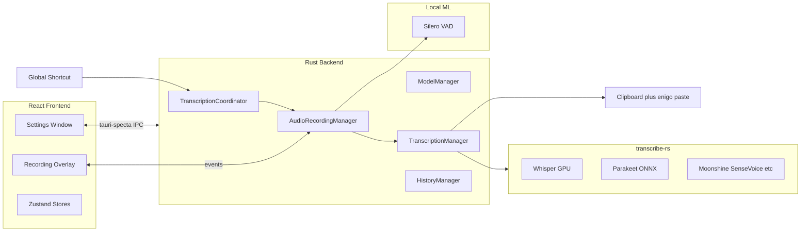

# Codebase overview

**Last reviewed:** 2026-07-11  
**Upstream:** [cjpais/Handy](https://github.com/cjpais/Handy) @ ~0.8.3 (pull-only baseline; see [UPSTREAM.md](../UPSTREAM.md))  
**Fork remote:** [felixbaileymurray/goldfish](https://github.com/felixbaileymurray/goldfish)

> Goldfish has diverged materially from the engine baseline: a dual-mode (Dictate/Keep) capture
> pipeline with an always-on Clean stage, medallion persistence, summarisation, and a full Astryx
> UI rebuild. The engine layer (audio/VAD/models/`transcribe-rs`) still tracks upstream; everything
> above it is Goldfish's own. See [fork-strategy.md](./fork-strategy.md).

## What this repository is

**Handy** is a free, MIT-licensed desktop app that transcribes speech locally and pastes text into whatever app is focused. Press a shortcut, speak, release — text appears in the active field. No cloud audio upload by default.

**Goldfish** (this repo) is a fork intended to become a **separate product** that reuses Handy’s engine rather than reimplementing offline STT. At the time of this overview, the codebase still uses Handy branding internally (`productName`, bundle ID `com.pais.handy`, i18n strings, etc.); only the Git remote and local folder name reflect “goldfish.”

## High-level architecture



### Technology stack

| Layer         | Technologies                                                                      |
| ------------- | --------------------------------------------------------------------------------- |
| **Frontend**  | React 19, TypeScript, Vite 6, Tailwind 4, Zustand (+ Immer), i18next (20 locales), Astryx design system |
| **Shell**     | Tauri 2.10                                                                        |
| **IPC**       | tauri-specta → auto-generated `src/bindings.ts` (~80 commands)                    |
| **Inference** | `transcribe-rs` (Whisper via Metal/Vulkan; Parakeet/Moonshine/etc. via ONNX)      |
| **Audio**     | `cpal` → `rubato` resample to 16 kHz → `vad-rs` Silero VAD                        |

## Runtime flow (core product loop)

1. User presses a **global keyboard shortcut** (toggle or push-to-talk) or sends CLI flags (`--toggle-transcription`, etc.) to a running instance via the **single-instance** plugin.
2. `src-tauri/src/transcription_coordinator.rs` serializes state: `Idle` → `Recording` → `Processing`.
3. `AudioRecordingManager` (`src-tauri/src/managers/audio.rs`) starts cpal mic stream; VAD filters silence; overlay shows mic levels.
4. On stop: audio → `TranscriptionManager::transcribe()` → optional post-processing (custom dictionary, Chinese OpenCC, LLM API or Apple Intelligence on macOS ARM).
5. Text is **pasted** into the focused app via clipboard + `enigo` (`src-tauri/src/utils.rs`).
6. Optional: WAV + transcript saved to SQLite history (`src-tauri/src/managers/history.rs`).

## Repository layout

| Path                           | Purpose                                               |
| ------------------------------ | ----------------------------------------------------- |
| `src/`                         | React settings UI, onboarding, model selector, i18n   |
| `src/overlay/`                 | Second Vite entry — minimal recording overlay window  |
| `src-tauri/src/`               | Rust application logic                                |
| `src-tauri/src/managers/`      | Audio, Model, Transcription, History                  |
| `src-tauri/src/audio_toolkit/` | Low-level recorder, VAD, resampling                   |
| `src-tauri/src/commands/`      | Tauri command handlers                                |
| `src-tauri/src/shortcut/`      | Global shortcuts, bindings, post-process LLM settings |
| `src/i18n/locales/`            | 20 translation JSON files                             |
| `.github/workflows/`           | CI: build, test, Playwright, Nix, release             |
| `flake.nix` / `nix/`           | Nix packaging                                         |
| `AGENTS.md` / `BUILD.md`       | Dev docs (root): commands, architecture, build setup  |

## Frontend

**Two Vite entry points** (`vite.config.ts`):

- Main: `src/main.tsx` → `src/App.tsx`
- Overlay: `src/overlay/main.tsx` → `src/overlay/RecordingOverlay.tsx`

**State:**

- `src/stores/settingsStore.ts` — persisted settings, devices, post-process config
- `src/stores/modelStore.ts` — models, downloads, progress
- `src/hooks/useSettings.ts` — React facade for settings store

**Settings UI sections** (`src/components/settings/sections.ts`): Shortcuts, Capture, Transcription,
Clean (post-processing), Output, Summarisation, Retention, App, Debug (dev-only), About — grouped
into Capture / Dictate / Keep / App. Settings are a full-panel overlay (gear icon), not a sidebar
section; the sidebar is scoped to product areas. See [decisions.md](./decisions.md) for the IA rationale.

**Onboarding:** Accessibility permissions → model download → done.

**Debug mode:** `Cmd+Shift+D` (macOS) / `Ctrl+Shift+D` (Windows/Linux).

## Backend

**Boot** (`src-tauri/src/lib.rs`): Tauri plugins (store, clipboard, global-shortcut, updater, single-instance, macOS permissions, …) → four `Arc` managers in state → tray → deferred shortcut init until permissions/onboarding.

| Manager       | File                        | Role                                                             |
| ------------- | --------------------------- | ---------------------------------------------------------------- |
| Audio         | `managers/audio.rs`         | cpal, VAD pipeline, devices, always-on mic, mute-while-recording |
| Model         | `managers/model.rs`         | Catalog, download, verify, engine selection                      |
| Transcription | `managers/transcription.rs` | Load/unload engines, GPU accelerators                            |
| History       | `managers/history.rs`       | SQLite + WAV under app data dir                                  |

**App data directory (Handy today):**

- macOS: `~/Library/Application Support/com.pais.handy/`
- Windows: `%APPDATA%\com.pais.handy\`
- Linux: `~/.config/com.pais.handy/`

**Other notable modules:**

- `cli.rs` — remote control flags for running instance
- `llm_client.rs` — optional LLM post-processing
- `apple_intelligence.rs` + Swift bridge — macOS ARM post-process
- `portable.rs` — portable mode (`portable` marker + `Data/` next to exe)
- `signal_handle.rs` — shared transcription trigger logic for CLI/signals

**Required dev asset:** `src-tauri/resources/models/silero_vad_v4.onnx` (see `AGENTS.md` for download URL).

## Models and engines

Users choose local ASR backends via `transcribe-rs`:

- **Whisper** variants (Small/Medium/Turbo/Large) with GPU when available
- **Parakeet V3** and others (Moonshine, SenseVoice, GigaAM, …)

Models are downloaded on demand from `blob.handy.computer` (defined in `managers/model.rs`). They are not shipped in the repo except VAD.

## Development commands

```bash
bun install

mkdir -p src-tauri/resources/models
curl -o src-tauri/resources/models/silero_vad_v4.onnx \
  https://blob.handy.computer/silero_vad_v4.onnx

bun run tauri dev    # full app
bun run lint
bun run format
```

**Prerequisites:** Rust (stable), [Bun](https://bun.sh/), platform deps in `BUILD.md`.

## Upstream relationship (pull-only)

The link to `cjpais/Handy` is **one-way**: Goldfish pulls engine and stability fixes from upstream
and contributes nothing back. Handy's own governance (feature freeze, community-feedback-before-PR,
issue/PR templates) does not apply here — do not open PRs or issues against `cjpais/Handy`. MIT
license retained; speech engine derived from Handy (copyright CJ Pais) — keep the attribution. See
[UPSTREAM.md](../UPSTREAM.md) for the merge workflow and [fork-strategy.md](./fork-strategy.md) for
the rationale.

## Observations relevant to Goldfish

1. **Production-shaped** — tray, single-instance, updater, autostart, 20 languages, Playwright, multi-platform CI, Nix.
2. **Clean IPC** — do not hand-edit `src/bindings.ts`; it is generated from Rust via tauri-specta.
3. **No Goldfish strings in tree yet** — product split not started in code.
4. **Heavy native deps** — first `tauri dev` may need platform setup (Metal, ONNX, accessibility permissions on macOS).
5. **Privacy-first** — local inference unless user configures LLM post-processing with their own API.

See [fork-strategy.md](./fork-strategy.md) for how Goldfish should evolve on top of this codebase.
