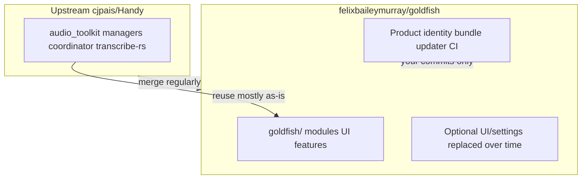

# Fork strategy: Handy as engine, Goldfish as product

**Last updated:** 2026-07-11

> **How this doc reads now.** Two things have changed since it was written, both recorded in
> [decisions.md](./decisions.md) (2026-07-11):
>
> 1. **Isolation is by _layer_, not by _directory_.** The original plan — quarantine all
>    Goldfish code under `src-tauri/src/goldfish/` and `src/goldfish/` — did not survive contact
>    with the product. Goldfish's differentiators (dual-pipeline, medallion persistence, the Clean
>    stage, the Astryx UI) are modifications to the engine's own decision points, not additive
>    sidecars, so they landed in place. What actually keeps merges clean is the **engine vs.
>    product layer split** described in [Mental model](#mental-model) below — the engine layer
>    tracks upstream, the product layer is owned outright. The `goldfish/` dirs are now a vestigial
>    seam (a `ping` command). Sections below that assume directory quarantine are flagged inline.
> 2. **The fork is pull-only (Handy → Goldfish).** Nothing is ever contributed back. Any guidance
>    below about cherry-picking to upstream, two-branch models for clean contribution, or Handy's
>    community process has been removed or is void.

## Intent

Goldfish is a **product fork**, not a cosmetic rebrand. It is a new application that **reuses Handy’s technical foundation** (Tauri, cpal + VAD + `transcribe-rs`, transcription coordinator, paste pipeline, model downloads) instead of reimplementing offline speech-to-text.

Handy describes itself as aiming to be [“the most forkable speech-to-text app”](https://github.com/cjpais/Handy/blob/main/CONTRIBUTING.md) — this fork takes it up on that (in the pull-only direction: we fork the engine, we don't feed back).

### What you need (not a global string replace)

1. **Clear product boundary** — separate app ID, data directory, releases, updater.
2. **Thin integration surface** — small, documented hooks into the engine.
3. **Upstream discipline** — regular merges from `cjpais/Handy` for bugfixes and core pipeline improvements.

## Mental model



| Layer         | Treatment                          | Examples                                                                                                         |
| ------------- | ---------------------------------- | ---------------------------------------------------------------------------------------------------------------- |
| **Engine**    | Sync from upstream; minimize edits | `audio_toolkit/`, `managers/`, `transcription_coordinator.rs`, `transcribe-rs`, `blob.handy.computer` model URLs |
| **Product**   | Yours; edit freely                 | Features, navigation, onboarding, release pipeline, icons                                                        |
| **Gray zone** | Touch lightly; few hook lines      | `lib.rs`, `App.tsx`, sidebar composition, i18n overlays                                                          |

## Git remotes and branches

```bash
git remote add upstream https://github.com/cjpais/Handy.git
git fetch upstream
```

### Current: single `main`, merge from `upstream/main`

This is what the fork uses today. Workflow lives in [UPSTREAM.md](../UPSTREAM.md). It works because:

- Goldfish-only code is identified by **path** (`src-tauri/src/goldfish/`, `src/goldfish/`), not by branch.
- There are no users yet, no Goldfish releases, no plan to contribute fixes upstream.

### Switch to two-branch when either trigger fires

| Branch          | Purpose                                           |
| --------------- | ------------------------------------------------- |
| `upstream-sync` | Stays close to `upstream/main`; engine fixes only |
| `goldfish`      | Default dev: product identity + Goldfish features |

Switch when **an upstream merge breaks something** and we need to ship a Goldfish-only hotfix
without pulling in the rest of that merge. (The fork is pull-only, so "contributing fixes back
upstream" is *not* a trigger — that path does not exist.)

Two-branch merge flow (for when we get there):

1. `git checkout upstream-sync && git merge upstream/main`
2. `git checkout goldfish && git merge upstream-sync`
3. `bun run lint`, `cargo test` / `bun run tauri build`

**What actually keeps merges clean** is the engine/product **layer** split, not the branch model
and not directory quarantine: keep the engine layer close to upstream and merge it; own the product
layer outright and never merge upstream's version of it.

### UPSTREAM.md (repo root)

Created 2026-05-19. Documents remotes, merge workflow, conflict hot-spots, and the merge-log table tracking last-merged upstream SHA + date. Update it on every upstream merge.

## Product identity (minimum for “a new app”)

| Item                | Handy today                                     | Goldfish direction                                                         |
| ------------------- | ----------------------------------------------- | -------------------------------------------------------------------------- |
| Bundle ID           | `com.pais.handy` in `src-tauri/tauri.conf.json` | e.g. `com.felixbaileymurray.goldfish` — new data dir; can run beside Handy |
| `productName`       | `Handy`                                         | `Goldfish`                                                                 |
| Updater             | cjpais releases + their signing key             | Disable until own releases, or own `latest.json` + keys                    |
| Windows signing     | cjpais Azure config in tauri.conf               | Remove/replace for local dev; own keys for release                         |
| About / links       | Handy URLs in `AboutSettings.tsx`               | Goldfish repo + your links                                                 |
| Icons               | `src-tauri/icons/`                              | New set                                                                    |
| `package.json` name | `handy-app`                                     | `goldfish` (tooling)                                                       |

**Keep unchanged (shared infrastructure):**

- Model URLs in `src-tauri/src/managers/model.rs`
- Silero VAD download URL
- Internal Rust crate names (`handy`, `handy_app_lib`) until rename pain is worth it

**Attribution (MIT):** Keep `LICENSE`; About can note speech engine derived from [Handy](https://github.com/cjpais/Handy).

## Extending without merge pain

### 1. Goldfish-only directories (superseded — vestigial)

```
src-tauri/src/goldfish/     # Rust: only a `goldfish_ping` smoke-test command remains
src/goldfish/               # React: empty barrel
```

These were meant to be the source of truth for "what is ours." In practice almost nothing lives
here — the real differentiators went in place (see the banner at the top). "What is ours" is now
answered by **layer** (product vs. engine), not by path. Keep these dirs only as a documented seam
for genuinely-additive future modules; a self-contained new capability (a summarisation-style
service) *can* still start here to keep it clearly non-engine. The original scaffold spec is in
[scaffold.md](./scaffold.md), retained as history.

### 2. The `lib.rs` touchpoint reality

Registering Goldfish into [src-tauri/src/lib.rs](../src-tauri/src/lib.rs) is **not** a one-liner. There are four upstream-owned regions you have to touch, all of which upstream also edits — so the goal is to **minimize conflict shape**, not eliminate it:

| Touchpoint                     | Where                            | Strategy                                                                                                                                                                                        |
| ------------------------------ | -------------------------------- | ----------------------------------------------------------------------------------------------------------------------------------------------------------------------------------------------- |
| `mod goldfish;` declaration    | top of `lib.rs`                  | One line, low conflict risk                                                                                                                                                                     |
| `collect_commands![...]` macro | inside `pub fn run()`            | Always append Goldfish commands at the **end** of the list, in a contiguous block preceded by a `// === Goldfish ===` marker. Conflicts become one-line trailing additions, trivial to resolve. |
| `collect_events![...]` macro   | same area                        | Same pattern as commands.                                                                                                                                                                       |
| State / setup registration     | end of `initialize_core_logic()` | One call: `goldfish::register_state(app_handle);`                                                                                                                                               |

The plugin registration block (`tauri_plugin_*`) is currently untouched by Goldfish; if it ever needs a Goldfish plugin, append at the end.

### 3. `src/bindings.ts` is a regenerated artifact

[src/bindings.ts](../src/bindings.ts) is auto-generated by tauri-specta from `collect_commands![]` (see [lib.rs](../src-tauri/src/lib.rs) where `specta_builder.export(...)` runs in debug builds). It WILL conflict on every upstream merge that touches commands.

**Resolution recipe:**

1. On merge conflict in `src/bindings.ts`, accept either side at random.
2. Run `bun run tauri build` (or `bun run tauri dev`) once — it regenerates the file from the merged Rust source.
3. `git add src/bindings.ts` and finish the merge.

Do not hand-edit `bindings.ts` ever. Do not try to merge it carefully — regeneration is the source of truth.

### 4. Post-transcription / engine hooks

**Resolved.** The post-transcription hook is now a real function: `process_transcription_output()`,
parameterised by a `CaptureMode` (Dictate/Keep), is the single spine that runs cleanup →
persistence → surface. It is the shared entry point for live capture, retry, and audio import (see
`src-tauri/src/actions.rs`, `commands/history.rs`, and the 2026-06-28 decision in
[decisions.md](./decisions.md)). New post-transcription behaviour extends this path rather than
picking a fresh hook. (An earlier version of this doc named a `process_transcription_output` that
did not exist; it does now, built deliberately as the pipeline spine.)

For any *new* seam not covered by that spine, still prefer additive over invasive:

| Need                | Prefer                                                                                                              | Avoid                                |
| ------------------- | ------------------------------------------------------------------------------------------------------------------- | ------------------------------------ |
| New shortcut action | Goldfish-only command invoked from a binding                                                                        | Copy-paste of `shortcut::handy_keys` |
| New settings        | Goldfish section behind its own route                                                                               | Edit every Handy settings file       |
| New UI screen       | New route in `src/goldfish/`, mounted from `App.tsx` via the [composition pattern](#5-frontend-composition-pattern) | Rewrite `App.tsx` wholesale          |

### 5. Frontend composition pattern (superseded)

This assumed Goldfish UI would be mounted as a slot/route beside Handy's. It wasn't — the UI is a
**full in-place Astryx rebuild** that replaced Handy's settings tree and primitives outright (the
product layer is owned, not merged). There is no `<GoldfishMount/>`; `App.tsx`, `Sidebar.tsx`, and
`src/components/settings/**` are Goldfish's own. Build UI directly, using Astryx components.

### 6. i18n (partially superseded)

The `goldfish.json` namespace was never adopted — Goldfish strings live directly in the existing
`translation.json` files, since the UI is owned rather than overlaid. Still sound: use `{{appName}}`
for the product name, and when adding a string, add the `en` key and let the other locales follow;
don't hand-translate all 20 by hand.

### 7. Settings store + history DB (superseded)

The `goldfish_`-prefix / separate-migration advice assumed a quarantined schema merged alongside
upstream's. In practice the history schema (`managers/history.rs`) and settings (`settings.rs`) were
extended **in place** — the `saved` flag, summary columns, and retention live in the main tables,
unprefixed, because Goldfish owns this layer and does not merge upstream's version of it. New
columns extend these tables directly; there is no upstream schema to avoid colliding with.

## Staying current with Handy

**Merges cleanly:** `audio_toolkit/`, VAD, cpal, `model.rs`, `transcribe-rs`, Tauri plugin security fixes.

**Conflicts likely:** `tauri.conf.json`, `lib.rs`, `App.tsx`, `Sidebar.tsx`, product-identity commits, bulk i18n edits.

**Cadence:** When you need a fix, or ~monthly — then smoke-test record → transcribe → paste.

**Direction:** Pull-only. Take Handy's **bugfixes and engine improvements**; contribute nothing
back. Goldfish features are never PR'd upstream, so Handy's feature freeze and discussion process
are irrelevant here.

## What not to do

- Maintain a duplicate “goldfish-core” crate unless merges fail repeatedly.
- Rename every `handy` symbol in Rust upfront.
- Use Handy’s updater endpoint for Goldfish builds.
- Open PRs or issues against `cjpais/Handy`, or shape a change to be upstream-contributable — the
  fork is pull-only.

## Dev environment prerequisite

```bash
curl -fsSL https://bun.sh/install | bash
# restart shell
cd /path/to/goldfish
bun install
mkdir -p src-tauri/resources/models
curl -o src-tauri/resources/models/silero_vad_v4.onnx \
  https://blob.handy.computer/silero_vad_v4.onnx
bun run tauri dev
```

Plus Rust stable and platform deps in `BUILD.md`.

## Phased implementation

| Phase                      | Scope                                                                                                 |
| -------------------------- | ----------------------------------------------------------------------------------------------------- |
| **1 — Product split**      | Bundle ID, productName, icons, disable updater, Goldfish About/README, `UPSTREAM.md`, upstream remote |
| **2 — Extension scaffold** | `goldfish/mod.rs`, `src/goldfish/`, trivial command + empty settings section                          |
| **3 — First feature**      | Real differentiator via coordinator / post-transcription hooks                                        |
| **4 — UI divergence**      | Onboarding, sidebar, remove unused Handy UI                                                           |
| **Ongoing**                | Upstream merges; log SHA in `UPSTREAM.md` and [decisions.md](./decisions.md)                          |

## Summary

| Goal                 | Approach                                                       |
| -------------------- | -------------------------------------------------------------- |
| New app, not rewrite | Engine + product layer                                         |
| Avoid merge hell     | New dirs + few hook lines                                      |
| Stay updated         | `upstream` remote + documented merges                          |
| Separate product     | New bundle ID, own releases/updater                            |
| Not a string replace | Identity + hooks first; internal `handy` names later if needed |
